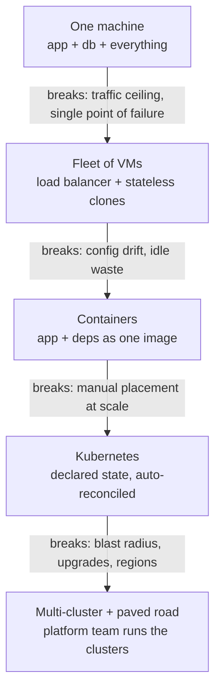

# Topic 0 notes — cloud infra fundamentals (evolution story)

Session date: 2026-08-09. Companion to the chat lesson; condensed for review.

## The chain (each era's fix creates the next era's problem)

1. **One machine** — app + DB + cron on one box. Cheap, simple. Breaks: capacity ceiling; any crash/deploy = outage; everything shares fate.

2. **Fleet of VMs** — scale OUT (not up) behind a **load balancer**; app copies must be **stateless** (state moves to a shared DB). Cloud = rent VMs in minutes (EC2, 2006). Core pattern forever: disposable stateless compute + carefully-managed stateful stores. Breaks: config drift across machines, "works on my machine," peak-sized fleets sit idle.

3. **Containers** — image = app + all deps as one immutable artifact; shares host kernel → starts in ms (vs VM minutes). Beat golden VM images (heavy) and Chef/Puppet convergence (fights drift forever). Docker, 2013. Clouds run containers *inside* VMs (both layers). Breaks: thousands of containers across hundreds of hosts — placement, restarts, scaling.

4. **Kubernetes** — orchestrator. Won vs Mesos/Swarm/Nomad (Borg pedigree, ecosystem). THE big idea = **declarative reconciliation**: write desired state; controllers loop observe→diff→act until actual = desired. Machine dies → loop restores replica count. Vocab: node, pod (1+ containers scheduled together), deployment, service (stable VIP), HPA, control plane. Same loop idea reappears in Temporal, GitOps, and agent loops. Breaks: one cluster = one blast radius; regions; scale ceilings; too complex for every product team to operate.

5. **Multi-cluster + paved road** — fleet of clusters (per region/env) + a platform org that runs them so product teams just ship code ("hotel, not house-building"). New problems and their Snap answers: placement → **hatchery/managed-mesh** (my team!); discovery → **Switchboard** registry (logical names like `mcs.snap`); safe rollout → **Mesh CI/CD (Spinnaker) + Depo canary analysis**; long multi-step orchestration → **mesh-flow on Temporal** (durable workflows = execution that survives crashes).

## State (the other half)
Compute is disposable; state is not. State goes to managed stores: OLTP (Spanner/CloudSQL), cache (Redis), blobs (GCS), warehouse (BigQuery), queues (Pub/Sub). Rule: anything you'd cry about losing does NOT live in a pod.

## Snap paved-road pieces (met throughout later topics)
Bootstrap (scaffold new service) • Machamp/SnapCI (build/CI) • Mesh CI/CD Spinnaker (deploy) • Depo (canary) • Switchboard (registry/identity) • snapc (runtime config) • Spookey (secrets) • LCA + SecProxy (user/service identity at the edge) • Workload Identity (pods get cloud perms, no stored keys) • Guard (authz policy) • Grafana/M3 (metrics) • Temporal (durable workflows). Note: Snap is already multi-cloud — hatchery manages GKE *and* EKS clusters (infra003-e = AWS).

## GCP/Snap → AWS translation

| Concept | Snap / GCP | AWS |
|---|---|---|
| Managed k8s | GKE (+ EKS at Snap) | EKS |
| VMs | GCE | EC2 |
| Simpler containers | — | ECS / Fargate (ask which they use!) |
| Pod → cloud identity | Workload Identity | IRSA / EKS Pod Identity |
| Secrets | Spookey / Secret Manager | Secrets Manager |
| Blobs | GCS | S3 |
| Warehouse | BigQuery | Redshift / Athena |
| OLTP | Spanner / CloudSQL | DynamoDB / Aurora |
| Queues/streams | Pub/Sub | SQS / SNS / Kinesis |
| LLM platform | Vertex AI | Bedrock (+ SageMaker) |
| Edge auth | SecProxy | ALB + OIDC / Cognito / internal proxy |
| Deploy pipelines | Spinnaker (Mesh CI/CD) | CodePipeline / Argo CD / Spinnaker |
| Durable workflows | Temporal, Cloud Tasks | Temporal, Step Functions |
| Managed Airflow | Flowrida | MWAA |

## Day-1 senior questions for the new company
1. What's the paved road to deploy a service? (their Bootstrap/Mesh equivalent — may just be Terraform + GitHub Actions + one EKS cluster)
2. How do services authenticate to each other and to AWS? (IAM everywhere? IRSA? an ATS-like token broker?)
3. Where do secrets live; how do rotations happen?
4. One cluster or many? What's the blast-radius / region story?
5. What observability does every service get for free (metrics/logs/traces)?
6. EKS or ECS/Fargate — and why?

## Recap in one breath
One machine breaks → clone it behind a load balancer (forcing state out of the app) → VMs drift and idle → containers make the deployable artifact immutable → too many to place by hand → Kubernetes reconciles desired state → one cluster is too risky → cluster fleets with a placement layer, a registry, and a paved road.

## Self-test (answers included)
- **Why must app copies be stateless?** The next request may land on a different copy; anything kept locally is lost or inconsistent — state moves to shared stores.

- **What is the reconciliation loop?** Controllers endlessly observe actual state, diff it against desired state, and act to converge — recovery becomes automatic (2 ≠ 3 replicas → start one). Reappears in Temporal, GitOps, and agent loops.

- **Why many clusters?** Blast radius, regional latency/failover, upgrade risk, scale ceilings — which then creates placement (hatchery) and discovery (Switchboard) problems.

## Status
- Topic 0 DONE (this file). Next per recommended order: Topic 2 (MCP & tool connectivity).