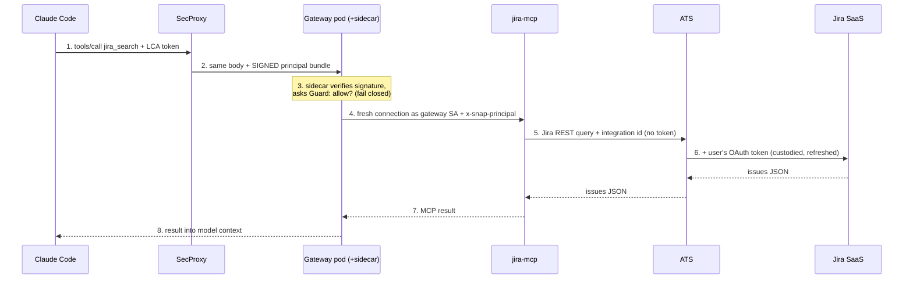

# Topic 2 notes — MCP & tool connectivity (Snap's evolution)

​

Session date: 2026-08-09. Condensed review notes; full sources in 00-curriculum-and-sources.md.

​

## What MCP is

LLMs only emit text; **tool calling** = model emits a structured "call function X with args Y",

the harness executes it, feeds the result back. Before MCP every app × every tool was a custom

integration (N×M). **MCP (Anthropic, Nov 2024)** standardizes the plug: a *server* exposes

tools/resources; any *client* (Claude Code, Cursor, an agent) speaks the same protocol.

Transports: **stdio** (local subprocess) and **streamable HTTP** (remote). N×M → N+M.

​

## Snap's evolution chain (dated; each fix creates the next problem)

​

1. **~2025 ad-hoc era** — engineers wire personal MCP servers into IDEs; Ads team builds its own

   Java MCP server + agent framework on the mesh (`Snapchat/mcp`, #ai-agent-infra). Vertical,

   per-team, no shared governance. Breaks: credential sprawl, unreviewed servers, zero audit.

2. **Aug 2025: MCP Proxy in snapaccess** (security-owned). Local transparent proxy (port 31337)

   that runs only *catalog-approved* servers (mcp-catalog, prodsec-reviewed forks, pinned Docker

   images), injects auth, audits calls. Chosen over: banning MCP (kills velocity), laissez-faire

   (kills security), building a remote gateway (too big, too early).

   Breaks: per-service OAuth dance per user, laptop-only (no shared/server-side agents), one

   review funnel, config sprawl per IDE.

3. **Feb 2026: snap-bridge-mcp (grassroots)** — one engineer ships a unified local bridge:

   ~141 modules / ~724 tools, reusing the engineer's own creds (initially even Chrome cookies —

   later ripped out, fail-closed). Massively adopted; officially unsupported. Lesson: **shadow IT

   is a demand signal — absorb it into the paved road, don't just ban it.**

4. **Jan 2026: MCP Golden Path RFC** (Kevin London) — names the two risks (bypass security vs

   lose velocity). Interim rules: colocated agent+MCP pods, read-only first, no Tier 0/1 data,

   bot tokens in Spookey. Key finding that forces a gateway: **per-user OAuth tokens for 3P

   services must be stored centrally.**

5. **Feb 2026: MCP Gateway design** — options: build (extract MCP Proxy server-side) vs partner

   (Docker's enterprise MCP Gateway, Snap as BYOC design partner) vs nothing. Chose Docker

   gateway + Snap-built **gateway-auth-sidecar** (Go): Docker owns proxy plumbing, Snap owns

   auth/policy. Tenets: every action traces to a human; mesh-native; platform provisions,

   teams own tool code. (Mar 2026: Spookey dropped for this path — **ATS is the sole

   credential path**.)

6. **Mar 2026: per-service MCP identity** — before: ALL MCP servers shared one mesh identity +

   one GCP service account (shared blast radius, prodsec's top concern). After: each MCP =

   own Switchboard service + own GCP SA via Workload Identity Federation (no exported keys),

   default-deny between MCPs, only the gateway's SA may call them.

7. **Mar–May 2026: gateway v2 scale-out** — CP/DP split (control plane = admin API/catalog/

   leader election; data plane = MCP traffic; same binary, `--mode` flag), Spanner state store,

   `gwctl` admin CLI, dynamic catalog updates without redeploys. Catalog lifecycle:

   pending → experimental → live.

8. **Jun 2026: consolidation + agents** — local per-service proxy routes retired; ONE local

   entry fronts the whole gateway; tools namespaced `mcp__mcp-gateway__<service>__<tool>`.

   Casper GA (June 15): autonomous agents consume the same gateway with per-user agent

   identities (`casper-<user>-...`) — gateway becomes the tool plane for agents, not just IDEs.

9. **Jul–Aug 2026: hardening + efficiency** — Guard RBAC enforce mode; Bootstrap-scaffolded

   9-step MCP onboarding; MCP Fleet Ops dashboards; **code-mode** (server-side JS fan-out over

   tools, 96–99% token cut — answer to "too many tools bloat the context window"); Slack MCP live.

​

## The auth chain (see diagram in chat)

IDE/agent —LCA→ SecProxy (verifies, strips client-supplied internal headers, mints SIGNED

context bundle) → gateway pod [Docker gateway container + auth sidecar; sidecar authenticates,

calls Guard `evaluate_policy` (enforce/shadow/disabled); FAILS CLOSED if sidecar down] →

downstream MCP server (fresh connection, identity re-stamped as gateway SA; servers accept

gateway-only callers → header impersonation moot) → ATS (`ats_integration_id`) which holds &

refreshes per-user OAuth tokens and decorates the outbound 3P request.

**Punchline: every hop swaps credentials; no hop forwards the credential it received.**

​

## Five themes (the senior lens)

1. **Auth is the whole game** — every architecture fork was forced by "where do credentials

   live and who can prove who's asking."

2. **Grassroots → paved road** — snap-bridge's demand was absorbed by the gateway, not banned.

3. **Blast radius shrinks over time** — shared SA → per-service identity (same instinct as

   one-cluster → many-clusters in topic 0).

4. **Two tiers** — local proxy for laptops, remote gateway for shared/autonomous agents.

5. **Token economics is real engineering** — tool sprawl bloats LLM context; code-mode/tool-

   search are the fixes.

​

## AWS translation (what the new team will likely build/own)

- MCP servers as containers on **EKS or ECS/Fargate** behind an internal **ALB**; streamable

  HTTP transport (multi-replica: avoid legacy SSE — Snap rejected it for pod-affinity 404s).

- Per-server identity = **one IAM role per service** (IRSA/Pod Identity) — the per-service-SA

  lesson, verbatim.

- Edge auth = ALB + OIDC (Okta/Entra) in place of SecProxy/LCA; signed principal propagation.

- ATS equivalent = an **OAuth token-broker service** (store/refresh per-user 3P tokens in

  Secrets Manager/DynamoDB, decorate outbound calls). This is a genuinely buildable, high-value

  component — and the concept to name-drop.

- Catalog/registry + policy = start with a git-reviewed servers.yaml + RBAC; audit to CloudWatch.

- Vendor-side: Anthropic/OpenAI remote MCP connectors will handle some of this; the enterprise

  gap they don't fill is exactly per-user 3P credential brokering + policy + audit.

​

## Day-1 senior questions

1. Where do per-user OAuth tokens for Jira/Slack/GitHub live, and who refreshes them?

2. Can every tool call be traced to a human (or an agent acting for a named human)?

3. Read-only first? How are write tools gated (review + user confirmation/elicitation)?

4. One shared identity for all MCP servers, or one per server?

5. How does a new MCP server get approved/registered — what's the catalog lifecycle?

6. What's the plan for tool sprawl (context bloat) — tool search? code-mode?

​

## Q&A follow-ups (2026-08-09)

​

### EKS vs ECS, and why

- **ECS** = AWS's own orchestrator. With **Fargate** there are no nodes/control plane to run at

  all — you hand AWS a container + CPU/RAM and it runs. Simple, cheap to operate, deep AWS

  integration (IAM per task, ALB, CloudWatch). Cons: AWS-only, no k8s ecosystem (no Helm charts,

  operators, network policies).

- **EKS** = managed Kubernetes. Pros: the entire k8s ecosystem (Helm — e.g. Langfuse ships a

  Helm chart — operators, Argo CD, network policies for default-deny like Snap's MCP fleet),

  portable skills, fine-grained control. Cons: you still own upgrades, node groups, add-ons —

  it needs platform-engineering capacity; cluster = blast radius to manage.

- Heuristics: **ECS when the container is the point; EKS when the ecosystem is the point.**

  Small team + stateless HTTP services (MCP servers, RAG APIs) → ECS Fargate is enough.

  Need Helm-packaged software, sidecar patterns, or org already has a central EKS platform →

  EKS. Rule #1: ride whatever paved road the company already has; don't fight it.

​

### One tool call end-to-end (sequence; matches diagram in chat)

​

​

Scenario: "what are my open Jira tickets?" → model picks tool `jira_search`.

① Claude Code → SecProxy: POST tools/call jira_search{assignee:me}; credential = **my LCA**.

② SecProxy → gateway DP: same body; LCA verified, client identity headers STRIPPED, adds

   **signed principal bundle** (only SecProxy holds the signing key → unforgeable).

③ Inside gateway pod: sidecar verifies signature → asks Guard evaluate_policy(user, jira-mcp)

   → allow/deny; sidecar unreachable = fail closed.

④ Gateway → jira-mcp: FRESH connection; network identity = **gateway's SA** (jira-mcp only

   accepts gateway SAs via allowed_callers); adds x-snap-principal: <user> + forwarded bundle.

⑤ jira-mcp → ATS: builds real JQL query; sends with `ats_integration_id=jira-from-mcp-server`

   + principal. **No token anywhere in the server.**

⑥ ATS → Jira SaaS: looks up/refreshes MY stored Jira OAuth token, attaches Authorization

   header, forwards. Jira returns issues JSON.

⑦ JSON flows back ATS → jira-mcp (formats MCP content) → gateway.

⑧ Gateway → (SecProxy) → Claude Code: result lands in model context; model writes the answer.

Failure mapping (my own CLAUDE.md recovery order!): expired LCA → fix at ① (`snapaccess

credentials refresh`); missing 3P grant → fix at ⑥ (`snapaccess mcp auth` / `gateway auth`);

dead local proxy → restart `snapaccess mcp up`.

Why not forward my token instead of swapping? (a) LCA isn't a Jira credential; (b) forwarding

would put user tokens inside every MCP server = theft surface; (c) central custody in ATS =

one place to store/refresh/revoke/audit.

​

## Recap in one breath

MCP standardized the tool plug → ad-hoc adoption scattered credentials → a local proxy with

an approved catalog owned the path → grassroots demand outran it → per-user token custody

forced a central gateway → bought the plumbing, built the auth sidecar → per-server

identities shrank blast radius → CP/DP split scaled it → agents joined humans as callers →

token economics (code-mode) became the next frontier.

​

## Self-test (answers included)

- **Why can't the gateway just forward my token?** The LCA isn't a Jira credential;

  forwarding real 3P tokens would seed every MCP server with user secrets (theft surface);

  ATS central custody gives one place to store, refresh, revoke, and audit.

- **Why per-server identities?** A shared service account is a shared blast radius — one

  compromised server compromises all. Per-service SA + default-deny networking contains it.

- **Why streamable HTTP, not legacy SSE?** SSE's separate handshake breaks behind load

  balancers with multiple replicas (handshake lands on pod A, stream on pod B → 404).

​

## Status

- Topic 2 DONE (incl. EKS-vs-ECS + sequence-walkthrough Q&A). Next: Topic 3 (RAG).