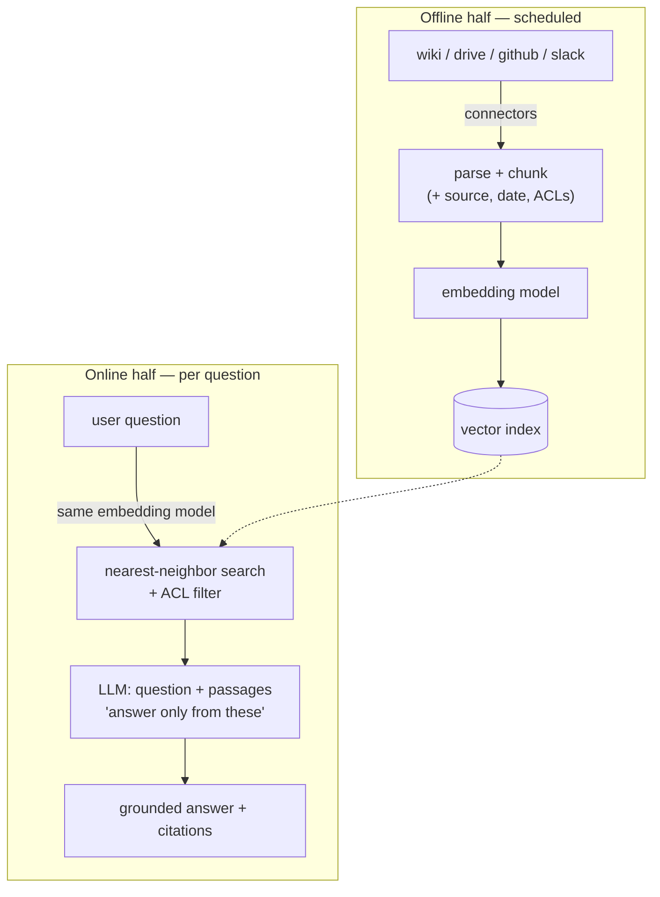

# Topic 3 notes — RAG & enterprise knowledge (Snap's three generations)

Session date: 2026-08-09. Condensed review notes; sources in 00-curriculum-and-sources.md.

## What RAG is and why it won

LLM knows nothing private/recent. Three options:

(a) fine-tune on company data — slow, expensive, stale on day 2, can't cite, and CANNOT do per-user permissions (a model can't "unlearn" a doc for one employee);

(b) stuff everything into context — millions of docs vs ~10^5-token windows, no;

(c) **RAG**: retrieve only the relevant passages per question, put them in the prompt. Fresh (reindex, don't retrain), citable, and permission-filterable per user. → RAG wins.

## The two halves (see diagrams in chat)

- **Offline/ingestion** (scheduled): connectors pull sources → parse+chunk into passages (~100s of tokens, carrying metadata: source URL, date, ACLs) → embedding model (text → ~768-number "meaning vector"; similar meaning = nearby points, "PTO" lands near "vacation") → vector index.

- **Online/query** (per question): embed the question with the SAME model → nearest-neighbor search → ACL-filter to passages the asker may read → prompt = question + top-k passages + "answer only from these, cite sources" → grounded answer.

- Hybrid search = semantic + keyword combined (acronyms/IDs favor keyword; concepts favor semantic). Reranking = second, better model reorders top candidates.

## Snap's three generations (evolution chain)

1. **SEAI** (built, Q3 2024, ai.sc-corp.net, Platform Eng): chatbot wrapping OpenAI/DeepSeek; RAG over UNRESTRICTED Confluence + GHE markdown + hand-ingested Drive docs (ingestion by Jira ticket!); Flowrida DAGs embed; **BigQuery vector search**; request logging to BQ. Breaks: corpus stale (ticket-driven), permissions crude (public-docs-only dodge), feature gap vs vendors (no image gen, length limits).

2. **RAGnarok** (platform, ITI/Enterprise Eng): RAG-as-a-service, not a chatbot. GCS upload → Pub/Sub → Dispatcher → Cloud Tasks → Ingester (parse/chunk/embed/index) into **Vertex AI RAG Engine** corpora (10k files/corpus limit → multi-corpus architecture); SEAI Ingestion Pipeline = Flowrida DAGs 2x daily (Confluence, GDocs, GHE READMEs); **Evaluator: nightly Ragas** (faithfulness, answer relevancy, context precision/recall) via Gemini + text-embedding-005 → BQ → Looker + alerts. Quality treated like uptime.

3. **Glean** (bought, Jan 2026): enterprise search + assistant + no-code agents. Killer features = **connectors at scale** (Workspace, Slack, Jira/Confluence, GHE, Salesforce, Asana, Coda, Gong…) and **permissions mirroring** (index respects per-doc ACLs; you only ever retrieve what you could open yourself) + Glean Protect (secret/PII redaction). Why buy won: connectors+ACL enforcement is a huge lift a vendor amortizes across customers. Post-Glean guidance: "knowledge-retrieval agents should just use Glean." NOTE: build & buy COEXIST — Glean for general knowledge; RAGnarok/Vertex corpora for curated bot-specific knowledge (SnappyBot's 50+ IT KBs).

## Production consumer: SnappyBot (IT support, Google ADK)

Coordinator + knowledge specialist (RAG over Vertex AI Search) + Jira specialist. The instructive part = the armor: semantic jailbreak detection (embedding similarity, 0.80 threshold), RAG **corpus-poisoning validation**, 10-layer URL validation, PII output filter, full conversation logging to BQ. Production RAG agent ≈ small RAG core + lots of security.

Also: ai-rag-api (ads-support RAG: Vertex retrieval + GPT-4o-mini via ATS, acronym query expansion, token logs → BQ table for cost).

## Vector store pragmatism (the bake-off)

seo-ml-retrieval, 132M vectors: **BigQuery Vector Search (TreeAH)** vs Vertex AI Vector Search 2.0 → equal quality, BQ ≈ 4.3x throughput at ~10% of the cost → BQ won (batch-shaped). Others in the wild: pgvector, S3 Vectors (evaluated by Memories), in-process pynndescent (small bots), Vertex AI Search (SnappyBot). Lesson: no single answer — batch/large-scale → put vector search WHERE THE DATA ALREADY IS (warehouse); low-latency online → dedicated store. Snap even built a "centralize embeddings" design (Bento embedding store) because every team had its own.

## The five hard parts (senior lens)

1. **Ingestion is 80% of the work** — connectors, parsing (PDFs!), chunking, freshness.

2. **Permissions make or break enterprise RAG** — leak one HR doc = security incident. Ladder: index-public-only (SEAI) → per-corpus ACL (RAGnarok) → full mirroring (Glean).

3. **RAG rots silently** — nightly evals (Ragas) + dashboards + alerts, or you won't notice.

4. **Poisoned docs are prompt injection** — anything in the corpus reaches the prompt; validate on ingest, filter output.

5. **Vector store choice is boring pragmatism** — scale, latency, cost, data gravity.

## AWS translation

- Managed RAG: **Bedrock Knowledge Bases** (S3 in → chunk/embed/retrieve out) ≈ Vertex RAG Engine.

- Glean-analog: **Amazon Q Business** (connectors + ACL mirroring) — or Glean itself (vendor, cloud-agnostic). LLM-vendor connectors (Claude/ChatGPT Enterprise) are the third contender — this is exactly the new team's consolidation battlefield.

- Embeddings: Titan / Cohere on Bedrock ≈ text-embedding-005.

- Vector stores: OpenSearch (k-NN; default KB backend), pgvector on Aurora/RDS, S3 Vectors.

- Pipelines: MWAA ≈ Flowrida; SQS/SNS ≈ Pub/Sub + Cloud Tasks; S3 ≈ GCS.

- Evals: Ragas is OSS (runs anywhere); Bedrock has built-in eval jobs.

## Day-1 senior questions

1. How do docs get into the index — connectors, tickets, crawl? How fresh is it?

2. How are per-document permissions enforced at retrieval time? Mirrored or public-only?

3. Where do vectors live, and what forced that choice (scale/latency/cost/data gravity)?

4. What evals run on retrieval quality — would we NOTICE degradation? (faithfulness, precision/recall)

5. What stops a poisoned document from steering answers?

6. Build vs buy split: what do Glean/Q Business/vendor connectors own vs our custom corpora?

## Recap in one breath

Models can't know your company → fine-tuning is stale, uncitable, permission-blind → retrieve per question instead → embeddings map meaning, vector search finds neighbors → ingestion keeps the map fresh, ACL filters keep it safe, nightly evals keep it honest → build the chatbot, platform the pipeline, buy the connectors-and-permissions layer, keep curated corpora for bots that must quote the blessed runbook.

## Self-test (answers included)

- **Why can't fine-tuning do permissions?** Knowledge baked into weights is served to every user; you can't filter weights per requester. Retrieval filters per user at query time.

- **What does faithfulness measure?** Whether the answer sticks to the retrieved passages — the RAG hallucination detector.

- **When does keyword beat semantic search?** Exact strings — error codes, ticket IDs, acronyms. Hence hybrid search in production systems.

## Status

- Topic 3 DONE. Next per recommended order: Topic 5 (LLM observability, evals & cost).
