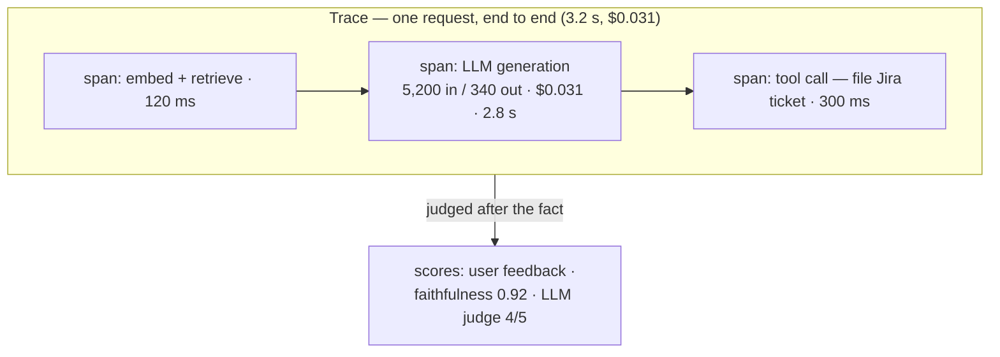

# Topic 5 notes — LLM observability, evals & cost

Session date: 2026-08-09. Condensed review notes; sources in 00-curriculum-and-sources.md.

## The core shift

Classic observability asks: is it up, fast, erroring? LLM systems add a failure mode classic monitoring can't see: **200 OK, fast, and WRONG** — plus a cost model where every request burns real money proportional to tokens. So LLM observability = three questions:

1. **What happened?** → traces

2. **Was it good?** → evals/scores

3. **What did it cost?** → token/dollar accounting

## Vocabulary (see trace-anatomy diagram in chat)

- **Trace** = one user request end-to-end. **Spans** = steps inside it (retrieval, generation, tool call). A **generation span** records prompt, completion, model, tokens in/out, latency, and computed dollar cost (price is per 1M tokens by model).

- **Scores** = quality judgments attached to traces afterwards: user feedback / heuristic checks / LLM-as-judge.

- **Prompt management** = versioned prompts fetched at runtime (deploy a prompt fix without a code deploy; roll back like code).

- **Datasets & experiments** = saved test cases; run before shipping a prompt/model change = regression tests for behavior.

## Snap's evolution

1. **Ad-hoc era**: each team logged prompts/tokens to its own BQ table (e.g. ai-rag-api's openai_usage.token_counts). No shared view; agents undebuggable; cost surprises.

2. **Standardize (build vs buy vs OSS)**: LangSmith/Datadog SaaS rejected (prompts = sensitive data can't leave); Grafana/M3 alone lacks LLM semantics; chose **self-hosted Langfuse** (OSS, Helm chart, LLM-native traces/scores/prompts/datasets). langfuse.sc-corp.net; humans via SecProxy, services via langfuse.snap; per-project API keys in Spookey; onboarding = channel + secproxy allowlist PR + Switchboard dependency (paved-road move). Adopters: Casper (+OTel+Sentry), sigma-agents (with redaction), SnapOS (full P1–P4: traces → feedback/grounding scores → sampled LLM-judge → datasets/experiments), agent-dredd (judge with meta-evaluation).

3. **Evals discipline** (the "was it good?" ladder):

   - Tier 1 user feedback: cheap, sparse, biased (angry users click more).

   - Tier 2 heuristic checks: citations present? JSON parses? grounded in retrieved text?

   - Tier 3 **LLM-as-judge**: second model grades against a rubric; SAMPLED on live traffic (cost); judge must be **calibrated against human labels** (meta-evaluation) or it's just vibes at scale.

   - Offline vs online: datasets/experiments gate changes pre-deploy; sampled judging watches prod; RAGnarok's nightly Ragas = scheduled offline eval of the live system (topic 3).

   - Three layers, don't confuse: MODEL evals (AGI Eval / lm-eval benchmark harness — "is this model good at X?"), APPLICATION evals (Langfuse datasets, Ragas — "is my pipeline good?"), LIVE monitoring (traces + scores — "is prod still good?"). Opik = design-time playground for prompt iteration, a separate tier from prod observability.

4. **Cost as a first-class metric**:

   - Per-inference: CodePal prints cost in every review footer, itemized inference vs tool-calls. Transparency → optimization: **model routing** (cheap model for easy work, escalate hard work; fallback chains) saved ~$730k, -19% cost, 38% faster; prompt caching hit 70–80%.

   - Per-org: **claudenomics** dashboard (token leaderboards, percentiles; seat-based Claude $ are NOTIONAL vs Codex credit $ are real; framed "signal, not score"); Manager AI Engagement Dashboard (BQ + Flowrida + Looker) — usage data treated as SENSITIVE.

   - Per-seat: 2,500-seat cap + inactivity audits; pooled credits (12,500/user/mo).

   - Three cost levers: **cheaper model** (routing), **fewer tokens** (caching, code-mode, RTK), **fewer calls** (batching).

5. **The trap**: traces contain prompts; prompts contain whatever users typed (PII, secrets). The observability system becomes the leak. → redaction before ingest, access control on the tool itself, retention limits.

## AWS / new-team translation

- Langfuse self-hosted on EKS (Helm) or ECS; alternatives: Arize Phoenix, W&B Weave, Datadog LLM obs (SaaS = same data-residency question).

- **Bedrock**: invocation logging → CloudWatch/S3 (+ Athena over logs); **application inference profiles** for per-team/project cost attribution; cost allocation tags; Bedrock Evaluations for managed LLM-judge jobs. OTel GenAI semantic conventions emerging — instrument once, stay portable.

- **The vendor-usage pipeline (their vertical-1 job, literally)**: Snap's lesson = vendor dashboards are lacklustre → pull vendor admin/usage APIs (Claude Enterprise / OpenAI Enterprise usage exports) into the warehouse via scheduled jobs (their Flowrida-analog = MWAA/Lambda), join with HR/org data, serve Looker-analog dashboards (QuickSight). That IS "own the observability pipeline for the vendor."

- Cultural design decision: usage leaderboards = "signal, not score"; decide early who may see per-person data.

## Day-1 senior questions

1. When an agent gives a bad answer, can we replay the exact trace (prompt, retrieved docs, tool calls)? Or is debugging archaeology?

2. What's cost attribution granularity — org / team / feature / request? Who's allowed to see it?

3. What gates a prompt change before deploy — is there a regression dataset?

4. Are traces redacted? Who can read them? What's retention?

5. Do we sample LLM-judge on live traffic, and is the judge calibrated against human labels?

6. Are we pulling vendor usage APIs into our own warehouse, or trusting vendor dashboards?

## Recap in one breath

LLMs fail invisibly (200 OK and wrong) and cost per request → trace everything with token-and-dollar-annotated spans → judge quality after the fact (feedback → heuristics → calibrated LLM judge) → gate changes with regression datasets, watch prod with sampled scores → make cost visible per-inference and per-org (routing, caching, batching are the levers) → and treat the trace store itself as sensitive: redact, restrict, expire.

## Self-test (answers included)

- **Why calibrate the LLM judge?** An uncalibrated judge applies systematic bias at scale — compare its grades against human labels (meta-evaluation) before trusting its trends.

- **Why are seat-based dollars "notional"?** Seats cost a fixed price; token-dollars shown there are list-price equivalents for signal only. Mixing them with real credit-dollars misleads budget decisions.

- **Why is the observability store itself a risk?** Traces contain prompts, and prompts contain whatever users typed (PII, secrets) — the debugging tool becomes the leak.

## Status

- Topic 5 DONE. Next per recommended order: Topic 6 (data pipelines for AI).
