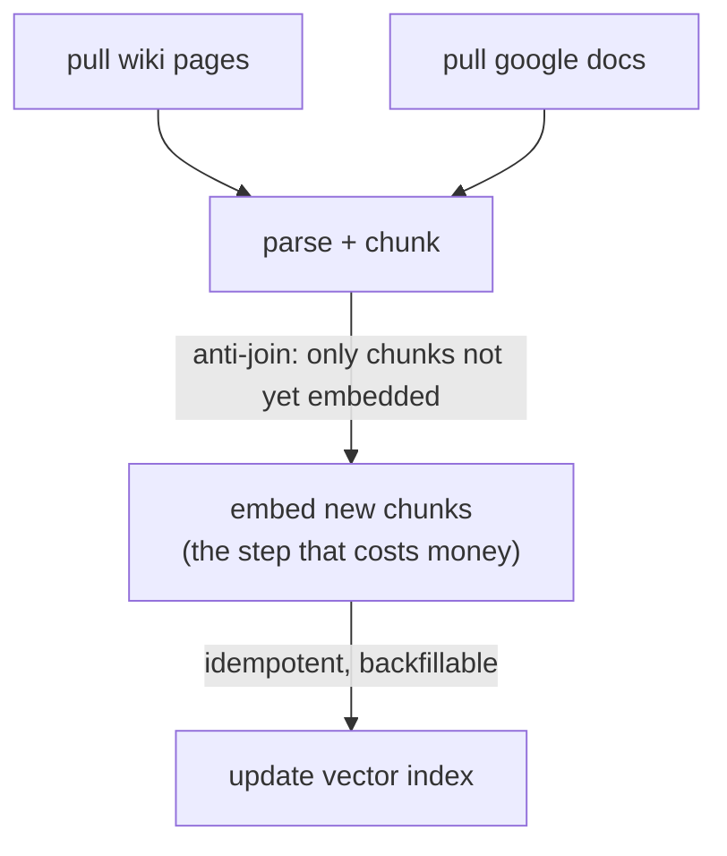

# Topic 6 notes — data pipelines for AI

​

Session date: 2026-08-09. Condensed review notes; sources in 00-curriculum-and-sources.md.

​

## Evolution chain

1. **cron on a box** — fine for one job. Breaks: no dependency ordering, no retries, no

   visibility, no history, no backfill; cron sprawl = topic-0 config drift all over again.

2. **Airflow (orchestrator)** — a **DAG** = tasks + dependencies + a schedule (see diagram):

   parallel tasks, fan-in waits, per-task retries, run history UI, **backfill** (rerun for

   past dates), **data windows** (each run owns an interval, e.g. "yesterday's docs").

3. **Managed platform (Flowrida)** — paved-road move again: Snap runs Airflow as a service

   (flowrida.sc-corp.net on GKE, CLI for local dev + backfills, config-based permissions,

   #flowrida support). Teams write DAGs; platform runs schedulers/workers.

4. **When schedules don't fit** — two other shapes:

   - **Event-driven**: react per item, not per schedule (RAGnarok: GCS upload → Pub/Sub →

     dispatcher → Cloud Tasks → ingest worker). Right when latency-to-fresh matters.

   - **Durable workflows (Temporal)**: per-entity, long-running, dynamic branching,

     human-in-the-loop, survives crashes (mesh-flow deploys, CodePal reviews, Casper runs).

   - Heuristic: **datasets on a rhythm → Airflow; items as they arrive → events; journeys

     per entity → Temporal.**

​

## The example DAG (diagram)

​

​

## The warehouse as AI's home base (BigQuery at Snap)

- **ELT**: land raw data first, transform *inside* the warehouse with SQL.

- **Remote models**: BQ can call a Vertex embedding model FROM SQL (`te005_model` via

  `us.vertex_ai_conn`) — embedding generation as a SQL statement, no service needed.

- **Incremental anti-join**: embed only rows not already embedded (cost control).

- **In-warehouse vector search**: TreeAH index + `VECTOR_SEARCH` (won the 132M-vector

  bake-off in topic 3 — data gravity).

- Scheduled queries; marts feeding **Looker** dashboards (claudenomics, manager dashboard).

​

## Snap's AI-pipeline catalog (5 recurring patterns)

1. **Knowledge ingestion** (feeds RAG): Flowrida DAGs 2x daily over Confluence/GDocs/GHE →

   RAGnarok corpora; event-driven half for ad-hoc uploads.

2. **Embedding maintenance**: incremental embed + index rebuild in BQ.

3. **Usage/cost pipelines**: AI-tool usage → BQ table (Flowrida) → Looker (claudenomics,

   Manager AI Engagement Dashboard) — topic 5's vendor-usage pipeline is exactly this.

4. **Eval pipelines**: nightly Ragas results → BQ → Looker + alerts (quality as uptime).

5. **LLM-as-a-pipeline-step** (the new twist): the LLM is a *transform inside* the DAG —

   SnapOS nightly doc summarization; CUP feature extraction at product scale (Gemini

   megaprompt → self-hosted Qwen3 Omni with **shared video prefill** so N prompts about one

   video pay the video cost once = caching as architecture).

   Consequence: a transform now costs money per row → **idempotency, dedup, incremental

   processing, and caching become financial controls, not just hygiene.** A careless

   backfill through an LLM step = a five-figure bill.

​

## Reliability vocabulary (know these cold)

- **Idempotent**: rerunning a task yields the same result, no dupes (rerun = the recovery

  story for everything).

- **Backfill**: run the pipeline as-of past dates (new metric? recompute history).

- **Partitioning**: data laid out by date so each run touches only its window.

- **Freshness SLA + data-quality checks**: row counts, null rates, drift alerts — pipelines

  fail silently more often than loudly (stale index from topic 3 = the classic).

​

## AWS translation

- Flowrida → **MWAA** (managed Airflow); light jobs → EventBridge Scheduler + Lambda.

- Pub/Sub + Cloud Tasks → **SQS/SNS/EventBridge**; event-driven ingest = S3 event → SQS →

  Lambda/ECS worker (or let **Bedrock Knowledge Base sync** own it).

- BigQuery → **Redshift/Athena over S3**; NOTE: no BQ-style "call the LLM from SQL"

  ergonomics — AWS pattern is a Glue/Lambda/Batch job calling Bedrock, or **Bedrock batch

  inference** (JSONL in S3 → results in S3, ~50% cheaper than online).

- Looker → QuickSight; dbt runs anywhere for SQL transforms.

- Vector upkeep → OpenSearch ingestion / S3 Vectors (topic 3).

​

## Day-1 senior questions

1. What runs scheduled jobs — MWAA, Lambda+EventBridge, or cron on a forgotten box? Who's

   paged when one fails?

2. Are tasks idempotent and backfillable? What's the story for "reprocess last month"?

3. Do embedding/LLM steps run incrementally or full-recompute each time? (cost!)

4. Where do usage + eval data land — one warehouse or scattered? Freshness SLA?

5. Any LLM-inside-pipeline steps — are they cached/deduped so a backfill can't cost $10k?

6. What data-quality checks/alerts exist on pipeline outputs?

​

## Recap in one breath

Cron can't order, retry, observe, or backfill → orchestrators model work as DAGs with data

windows → run the orchestrator centrally as a paved road → events for per-item freshness,

Temporal for per-entity journeys → land everything raw in the warehouse and transform there

(even embeddings, even vector search — data gravity) → once an LLM is a step inside the

pipeline, idempotency and caching are money, not hygiene.

​

## Self-test (answers included)

- **Why does backfill require idempotency?** Backfill is a mass rerun; non-idempotent tasks

  duplicate or corrupt data on every rerun.

- **When Temporal over Airflow?** Airflow = datasets on a rhythm with data windows; Temporal

  = long-running per-entity journeys with dynamic branching and human gates (mesh-flow

  deploys, agent runs); event queues = per-item freshness.

- **Why is caching a financial control here?** A transform that costs money per row turns a

  careless backfill into a five-figure bill — dedup, caching, and incremental processing are

  the brakes.

​

## Status

- Topic 6 DONE. Next per recommended order: Topic 4 (LLM serving & model access).