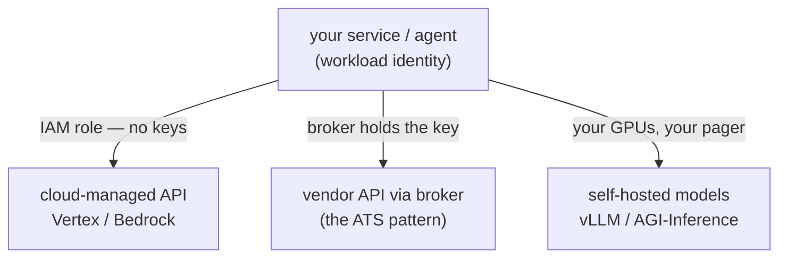

# Topic 4 notes — LLM serving & model access

Session date: 2026-08-09. Condensed review notes; sources in 00-curriculum-and-sources.md.

## The question this topic answers

Once a company adopts AI, every service and employee needs model access. Who may call which model, through which pipe, with whose credentials, at what cost — and who notices when it goes wrong?

## Why you buy serving as an API (mostly)

Serving = loading model weights onto GPUs behind an inference server (vLLM etc.) that batches concurrent requests to keep GPUs busy. It's specialized, capacity-constrained ops. So the default is an API; the real decision is WHICH road (see diagram):

1. **Cloud-managed API** (Vertex/Bedrock): models run inside YOUR cloud org's trust boundary; auth = IAM/workload identity (no keys); billing on the cloud invoice; audit + data-residency built in. DEFAULT.

2. **Direct vendor API via a broker** (OpenAI via ATS): for models not on your cloud. Never raw keys in services — a broker custodies keys, allowlists per caller/model/path.

3. **Self-hosted open weights** (AGI-Inference): max control + unit economics at huge scale; max ops burden. Last resort.

## Snap's evolution

1. **Key sprawl threat** → **ATS as the chokepoint for OpenAI** (same broker from topic 2's OAuth story!): config allowlists per caller SA / method / path / MODEL; prod use needs privacy review; playground.sc-corp.net for humans. Rare latency exceptions = key in Spookey.

2. **Vertex mandate**: "no 3P LLM API keys in production; all LLM usage via Vertex AI" — which serves BOTH Gemini and Claude (publishers/anthropic). Interesting architecture choice: NO central proxy — services call Vertex directly with their own workload SA (`roles/aiplatform.user`) + egress allowlist. Policy+IAM instead of a box. Tradeoff: no bottleneck/SPOF, but quota, metering, routing left fragmented → later gaps.

3. **Self-hosting (AGI-Inference, LLM Platform team)**: OpenAI-compatible API on mesh (`/v1/chat/completions`, route tag per model, LCA auth). Onboard a model = YAML PR to `model-registry` (paved-road onboarding, same shape as servers.yaml). Hosts Qwen3 family, DeepSeek distills, gpt-oss, BGE rerankers, embeddings; powers My AI + CUP FEv2 (shared video prefill = pay the video once). WHY: product-scale unit economics + model control. Constraints: license must allow commercial use; >32B params needs a business case (GPU $$); legal bans CODE GENERATION on self-hosted models.

4. **The gaps show** (each grew its own partial fix):

   - ATS lacks token metering → product side built **GenAI Proxy** (key custody, model-name masking, per-use-case TPM/token rate limits, per-team cost metering) for My AI.

   - Evals cluster needed one URL over many providers/protocols → **gke-llm-gateway** (LiteLLM-like: /chat/completions + /messages + /responses, GPT→ATS, Claude→Vertex, Gemini→Vertex, cross-protocol translation).

   - Coding agents need per-user spend policy + model routing → **LLM router in design** (snap_bench OSS survey: LiteLLM, Bifrost, Portkey, APISIX, Envoy ext_proc).

   LESSON: Snap grew THREE partial gateways organically. A new team can make the gateway decision once, deliberately, early.

5. New model/provider intake = **go/ihub** (security + privacy + legal review). An approval path for models is itself a platform feature.

## Capacity & routing vocabulary

- **Quotas**: TPM (tokens/min) and RPM (requests/min) per model/region — the resource limits of the LLM world; noisy-neighbor risk when teams share them.

- **Provisioned throughput**: pre-purchased dedicated capacity for critical paths vs on-demand best-effort.

- **Fallback chains**: primary model errors/throttles → automatic retry on secondary (CodePal: modelrouter with fallback).

- **Tiered routing**: cheap/fast model for easy work, flagship for hard work — CodePal's routing saved ~$730k, -19% cost, 38% faster (topic 5 tie).

## AWS translation & the new team's decision framework

- Vertex → **Bedrock**: Anthropic/Meta/Mistral/Cohere/Nova models in-account; IAM auth; invocation logging (topic 5); **application inference profiles** (cost attribution); provisioned throughput; cross-region inference; **Bedrock Guardrails** (content/PII filters); batch inference (topic 6).

- The OpenAI wrinkle: OpenAI models are NOT on Bedrock — cloud-managed OpenAI = **Azure OpenAI** (different cloud), so AWS-based companies either go multi-cloud at the AI layer or use the direct OpenAI API behind a **key broker** (Secrets Manager custody + small proxy / LiteLLM) — the ATS lesson, verbatim.

- Self-host on AWS = SageMaker endpoints or EKS+vLLM — likely NOT worth it for a small enterprise team; know the option, resist it.

- Off-the-shelf router if needed: LiteLLM / Portkey (self-hosted) — one URL, virtual keys, spend limits per user/team, fallbacks.

- Per-use-case framework: who calls (human seat vs service) × data class × latency/scale → vendor enterprise app (seats) | Bedrock (default programmatic) | brokered vendor API | self-host (last resort).

## Day-1 senior questions

1. Are prod LLM calls IAM-authenticated or on long-lived API keys? Where do keys live, who rotates them?

2. Is there a mandated transport (e.g. Bedrock-only) and a formal exception/intake process for new models (legal + privacy + security)?

3. How are quotas shared — can one team's batch job starve the chatbot? Provisioned throughput for critical paths?

4. Can we attribute spend to team/feature (inference profiles, tags), not just one bill?

5. What happens when the primary model/region fails — fallback chain or outage?

6. Is anyone self-hosting? What forced it, and who carries the pager?

## Recap in one breath

Models are GPU-hungry, so buy access as an API → prefer the cloud-managed road (in-boundary, IAM, no keys) → broker what isn't on it (never raw keys in services) → self-host only when product-scale economics force it → and decide the gateway question early, or metering, protocol translation, and spend policy will each grow their own partial gateway.

## Self-test (answers included)

- **Why does IAM auth beat API keys?** Keys leak, are anonymous, and revoke coarsely; IAM ties every call to a named workload with no secret to steal.

- **Which three gaps did direct-with-IAM leave at Snap?** Token metering (→ GenAI Proxy), one-URL multi-provider translation (→ gke-llm-gateway), per-user spend policy and routing (→ LLM router in design).

- **Why is the OpenAI-on-AWS story awkward?** OpenAI models aren't on Bedrock; their managed home is Azure — so it's multi-cloud at the AI layer, or the direct API behind a key broker.

## Status

- Topic 4 DONE. Next per recommended order: Topic 7 (AI coding agents & vibe coding), then Topic 1 (enterprise rollout & governance) to close.
