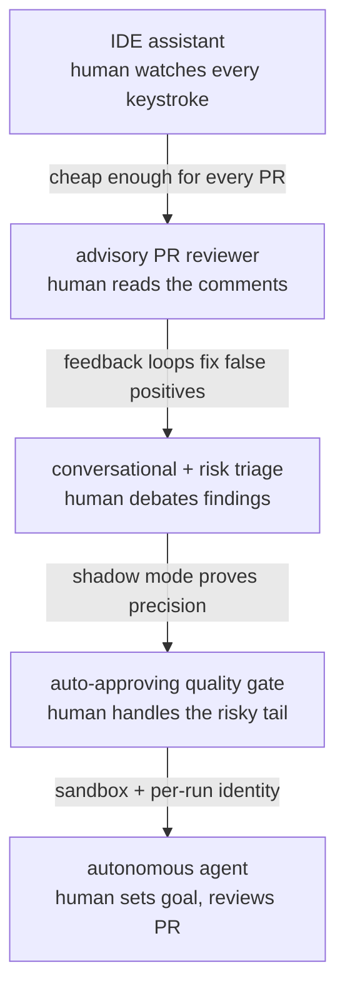

# Topic 7 notes — AI coding agents & vibe coding for non-devs

​

Session date: 2026-08-09. Condensed review notes; sources in 00-curriculum-and-sources.md.

This topic = the new team's vertical 2 ("vibe code applications for non-technical, to

production standard").

​

## Half A — CodePal: the trust ladder (see diagram)

​

​

Advisory reviewer (Aug 2025, gemini-flash, ~$0.005/review, manual `@codepal review`) →

per-repo config + auto-review defaults (Dec 2025) → multi-pass loop + conversational reviews

+ risk triage (2026) → auto-approving quality gate (45k reviews, 2,050 authors, 1,100 repos).

Problem→solution chain:

- Reviewer bottleneck (~11h wall-clock waiting-to-merge; AI-accelerated PR volume) → the bot.

- Big PRs vs model/workflow limits → **Temporal child workflows chunk the diff; big payloads

  offloaded to GCS** (topic 6 durable-journeys, topic 0 blob store).

- Single-pass inconsistency (helpfulness ~50-70% in early Slack) → scout pass → multi-pass

  (≤3) → verification turn → embedding dedup of findings.

- Missing cross-repo context → in-review **code-search tools** (get_definition, find_callers)

  with a per-review cost ledger.

- Repeated false positives → ��/�� reactions; conversational threads where the bot CONCEDING

  a finding is persisted as a **learning**; per-path repo config.

- **Bounded authority config**: `.github/codepal.yaml` separates `context` (informational)

  from `instructions` (directive) — and a repo CANNOT disable security findings. Steer, not

  silence.

- **Prompt-injection defense**: untrusted diff placed BEFORE trusted instructions in the

  prompt; deterministic prompt assembly with per-section token budgets (skip, don't

  truncate); 70-80% prompt-cache hit rate.

- Trust for auto-approval → **shadow mode first** (log would-be approvals, measure precision

  vs human actions), two-level opt-in gates (service allowlist + repo `review.approval`),

  risk ceilings (`max_risk_level`), **SOX carve-outs** (compliance code always needs humans),

  never requests-changes (approve or stay silent).

- Cost → per-review $ footer, itemized; model routing saved ~$730k (topic 5).

​

## Half B — Casper: the infrastructure of autonomy

Slack/Jira/web ask → PR out. Alpha spring 2026; 675 PRs/70 repos by May; 500+ prod PRs.

Infra shape (all prior topics assembled):

- Each run = **ephemeral k8s Job** — fresh container, destroyed after (disposable compute).

- **Temporal** orchestrates the journey (long-running, crash-safe — topic 6 shape 3).

- **Per-run/per-user identity** (`casper-<user>-...` service accounts; every action traces

  to a named human — topic 2 tenet).

- Tools via **MCP gateway**; knowledge via Glean WITH the requesting user's permissions

  (agent can't read what its human couldn't — topic 3 ACL lesson).

- **Agent Sandbox (abox)**: egress filtering, dependency proxying, MCP-proxy-only network.

  Threat model = the agent ITSELF is untrusted (prompt-injected via an issue/README, or

  poisoned dependency). Autorun outside sandbox = disabled.

- **Agents reviewing agents**: Casper's PRs are gated by CodePal (Overseer loop) — the trust

  ladder's rungs compose.

​

## Half C — vibe coding for non-devs (the enablement ladder)

1. **Chat** (ChatGPT/Gemini/Claude seats) — answers, drafts.

2. **No-code agents** (Glean agents, Workspace Studio, Gems) — with **tiered publishing

   governance**: personal agents auto-approved; org-wide publishing requires review;

   read-only first. Real wins: sales pipeline-drafter agent; "Pitch Perfect" Gem credited

   with $300k in closed deals.

3. **Vibe-coded apps** (Claude/Claude Code) — enablement: weekly vibe-coding office hours

   (design team), AI hackathon (shared GCP project + Vertex credits + write-actions enabled

   FOR THE WEEK = time-boxed permission expansion), CLAUDE.md/skills to pre-catch issues.

4. **The deployment gap** (the key insight): non-engineers can BUILD an app but can't

   DEPLOY one — cloud setup is "way outside the comfort zone." Grassroots answer:

   **autohost** — copy a prompt into Claude, it deploys via managed CI with Google-group

   access control (SSO-gated, default-private). Formal analogs: Snap Wings (lightweight

   internal app hosting), Release Manager/GAE paths.

5. **"Production standard" guardrails**: mandatory human review of AI output before prod/

   external use; snap-semgrep scanning; SSO-default hosting; and the **ownership lesson** —

   Snap's agent squad sunsets with agents funded by owning teams' KTLO. Every AI-built app

   needs a named owner or it rots into unowned risk.

​

## The pitch for the new team

The hard part of vibe coding is NOT code generation (Claude does that). It's giving

non-engineers a **safe deployment target**: hosting with SSO built in, access control by

group, secrets handled, scanning on deploy, an owner recorded. "Autohost with governance" =

an internal app platform = the productizable core of vertical 2.

​

## AWS translation

- CodePal analog: mostly BUY now — Claude Code GitHub Actions (@claude review), Copilot code

  review, CodeRabbit etc.; Snap's config lessons still apply (per-repo instructions with

  bounded authority, severity gates, shadow-then-enforce).

- Casper analog: hosted coding agents or Claude Code in CI; infra shape = **ECS Fargate

  ephemeral tasks** (perfect fit for run-and-destroy), Step Functions/Temporal for the

  journey, **IAM role per run**, egress-filtered VPC (allowlist proxy, VPC endpoints, no

  open NAT), CodeArtifact as dependency proxy, CloudTrail audit.

- Vibe-app hosting ladder: Claude artifacts/apps shared in-org (zero-infra tier) →

  **App Runner / Amplify Hosting / S3+CloudFront behind ALB+OIDC (Okta/Cognito)** with an

  IaC template = the autohost analog; publishing tiers (personal auto / org-wide reviewed).

- Guardrails: human-review policy, Semgrep/CodeQL + secrets scanning in the deploy pipeline,

  default-private hosting, ownership registry.

​

## Day-1 senior questions

1. What can a non-engineer deploy today, and where? Paved path or DM-an-engineer?

2. Is there an agent sandbox story — egress, dependencies, per-run identity? Is the agent

   treated as untrusted?

3. Do AI reviews gate merges (authority) or just comment (advisory)? Was there shadow-mode

   data before enforcement?

4. Who OWNS an AI-built app after the demo — lifecycle, KTLO, offboarding?

5. What's the human-review policy for AI output reaching prod or external eyes?

6. Are agent-authored PRs traceable to a named human, and are they reviewed by AI, human,

   or both?

​

## Recap in one breath

An AI reviewer earns authority rung by rung — feedback kills false positives, concessions

become learnings, shadow mode proves precision, carve-outs keep humans on the risky tail →

autonomy adds containment: ephemeral compute, per-run identity, permission-inherited

knowledge, a sandbox that treats your own agent as untrusted → and vibe coding succeeds on

the deployment target (SSO, access control, scanning, an owner), not on prompting skill.

​

## Self-test (answers included)

- **Why does CodePal approve-or-stay-silent instead of blocking?** A false block costs more

  trust than a false approval costs risk — whatever isn't auto-approved still gets human

  review anyway.

- **What justifies sandboxing your own agent?** It ingests untrusted text (issues, READMEs,

  dependencies) that can carry prompt injection — treat the agent as potentially hijacked:

  egress filtering, dependency proxying, per-run identity.

- **Why is deployment the vibe-coding bottleneck?** The model already writes the code;

  hosting, auth, access control, and ownership don't come with it — so build the safe target.

​

## Status

- Topic 7 DONE. Remaining: Topic 1 (enterprise rollout & governance) — the capstone.