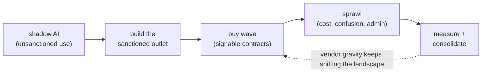

# Topic 1 notes — enterprise AI rollout & governance (capstone)

Session date: 2026-08-09. Condensed review notes; sources in 00-curriculum-and-sources.md.

Maps to: new team's vertical 1 (own a vendor) + the 2-year consolidate-and-sunset roadmap.

## The rollout lifecycle (Snap's arc)

0. **Shadow AI**: employees paste company data into consumer chatbots. Prohibition alone fails (topic 2 lesson: shadow usage = demand signal).

1. **Build the sanctioned outlet** (SEAI, Q3 2024): fastest way to give a safe option; differentiator = RAG on internal docs. Build-first is about SPEED + control, not beating vendors on features.

2. **The buy wave** (2025–26): vendors became signable — no-training-on-your-data clauses, Okta SSO/SCIM, retention controls (90-day), admin feature controls. Portfolio: chat (ChatGPT Enterprise, all FTEs), search (Glean), workspace AI (Gemini/NotebookLM/Studio), dev tools (Cursor / Claude Code 2,500 seats / Codex riding the ChatGPT contract / Copilot), pilots for the rest (Slack AI — closed, Agentspace, Agentforce, creative tools).

3. **Sprawl**: overlapping tools, seat costs, "which tool for what?" confusion (the FAQ literally has to explain SEAI vs ChatGPT), admin burden per tool (each = SSO + reviews + feature audits + comms).

4. **Consolidation posture**: hedge publicly ("each tool serves different needs… feedback will guide future investments"), measure usage, sunset quietly (SEAI = obvious casualty; SnappyBot got a buy-vs-scale evaluation), consolidate channels (#ai-general) and docs (go/ai-docs) too. THE NEW TEAM'S 2-YEAR ROADMAP = STAGE 4 AS A MANDATE.

## What "owning a vendor" means day-to-day (vertical 1 job description)

- **Feature gating cadence**: vendors ship features monthly; each needs review before enablement. Snap's ChatGPT disabled list: chat/canvas sharing, voice, Codex-in-ChatGPT, Record, external GPT publishing, Skills, all connectors except Google Workspace; an "under review" queue behind it. A tool is a FEATURE MATRIX, not a yes/no.

- **Connector veto**: ChatGPT's Drive Synced Connector FAILED Snap security review → users told to use Glean/Gemini for Drive data. Owning the vendor = power to say no per feature.

- **Seat & credit management**: 2,500-seat cap + waitlist + inactivity audits to reclaim; pooled credits (12,500/user/mo) + asking the vendor for better guardrails.

- **Population tiers**: FTEs vs contingent workers get different defaults (Gemini default for CWs; Glean needs justification).

- **Usage pipeline** (topic 5) feeding renewals: usage receipts = negotiation leverage and consolidation evidence.

- Escalation channel to vendor; comms + training around every change.

## The governance stack (see diagram; bottom-up)

Policy (what data where — e.g. "never put user data in any AI tool") → Identity & contracts (SSO/SCIM everywhere, no-training, retention, DPA) → Feature gating → Data protection (Glean Protect redaction, tented-space/repo exclusions, bot auto-disable with external guests, session expiry) → Process (go/ihub intake; human review of AI output before prod/external; security reviews — Cursor case: 4th-party subprocessor risk formally accepted, MDM-enforced config, Workspace Trust on) → Measurement → People & enablement.

Punchline: a tool is never just "approved" — it's admitted into every layer.

## Adoption engineering (the soft machinery that makes rollouts stick)

- **AI Champions**: per-department advocates bridging to the AI Center of Excellence.

- Training ladder: tool 101/201s (vendor-delivered), office hours, facilitator programs.

- **Wins marketing**: #ai-wins digests, newsletters, demo forums — social proof drives adoption more than mandates.

- **The AI Loop** forum: recurring "stop doing X, start doing Y" retros — rollout as an iterating product, not a launch event.

- Adoption KRs (e.g. 70% dev WAU target) + "signal, not score" culture (topic 5): usage data motivates, never punishes.

## The consolidation playbook (the 2-year roadmap's engine)

Per overlapping tool, score: **usage receipts** (real data) × **unique capability** (what would break?) × **contract timing** (renewals = decision windows) × **switching cost** (data export, workflow migration, retraining) → keep / scale / sunset.

- Sunsetting is a MIGRATION PROJECT (export, workflow porting, comms, deadline), not an email announcement.

- Political air cover matters: CTO visibility (the new team has it) + usage receipts are what let you sunset a tool with fans.

- Expect vendor gravity: LLM-vendor suites (Claude/ChatGPT enterprise) absorb adjacent tools' features every quarter (connectors ≈ search; agents/apps ≈ no-code platforms) — the roadmap's "consolidate onto Claude and OpenAI" bet.

- HR as main partner: owns training/comms reach into every department; HR data is also the MOST sensitive corpus (topic 3 permissions) — trust with HR = trust with the hardest case.

## Day-1 senior questions

1. What's the approved-tool list, and the intake path for adding one? Who decides?

2. Which vendor features are disabled today, and is there a review cadence for new ones?

3. What usage data exists per tool — what would we sunset if renewals were tomorrow?

4. How do FTE vs contractor tiers differ?

5. Where is the human-review-of-AI-output policy written, and is it enforced anywhere?

6. Who are the champions/power users per department — especially in HR?

## Recap in one breath

Shadow AI → build the sanctioned outlet fast → buy the portfolio once contracts are signable (no-training, SSO/SCIM, retention) → sprawl arrives as cost, confusion, and admin burden → measure relentlessly, hedge publicly, sunset quietly — a tool is admitted into every layer of the governance stack, and consolidation runs on usage receipts, renewal windows, and air cover.

## Self-test (answers included)

- **Why hedge publicly about sunsets?** Pre-announcing kills adoption of current tools and triggers hoarding/backlash before usage data justifies the decision.

- **What makes a vendor contract "signable"?** No-training-on-your-data clause, SSO/SCIM, retention controls, per-feature admin gating.

- **Why is HR both the partner and the hardest case?** HR has training/comms reach into every department — and the most sensitive data corpus in the company (topic 3's permissions problem at maximum difficulty).

## Status

- Topic 1 DONE — CURRICULUM COMPLETE (all 8 topics, notes files 01–08 + sources in 00).
